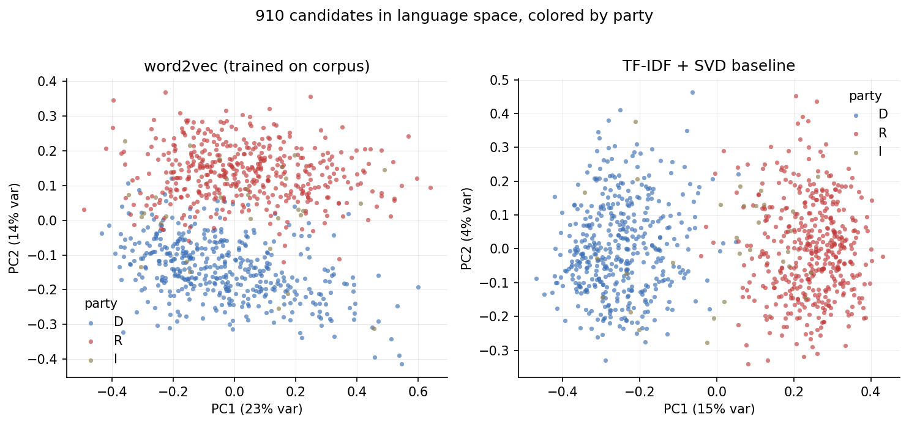
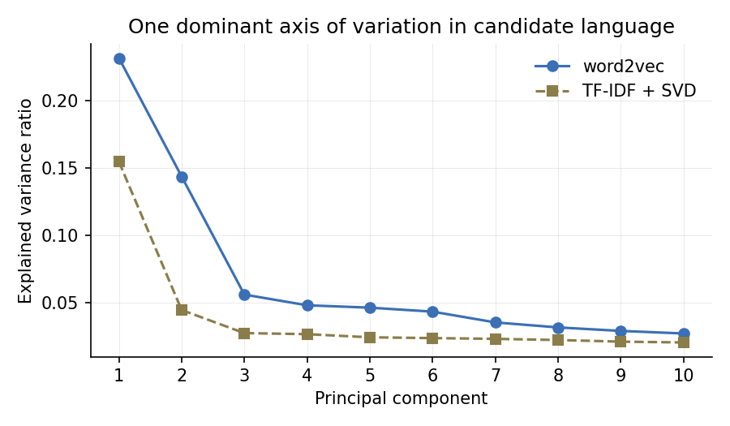
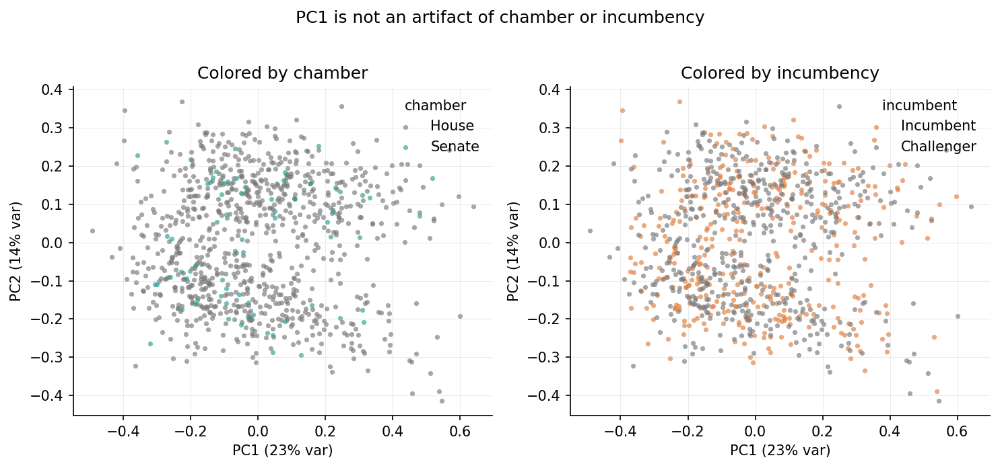
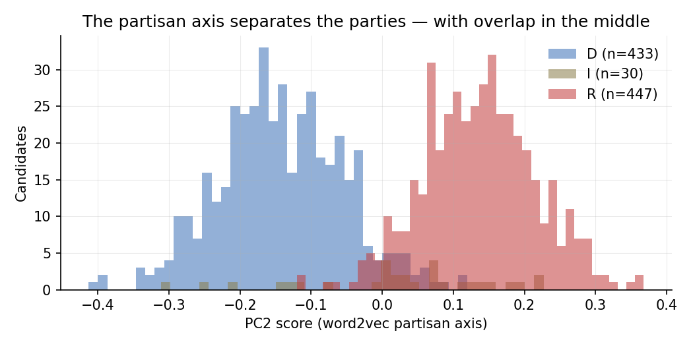
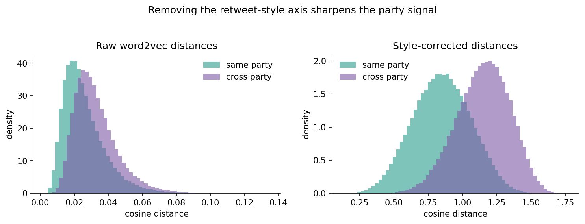
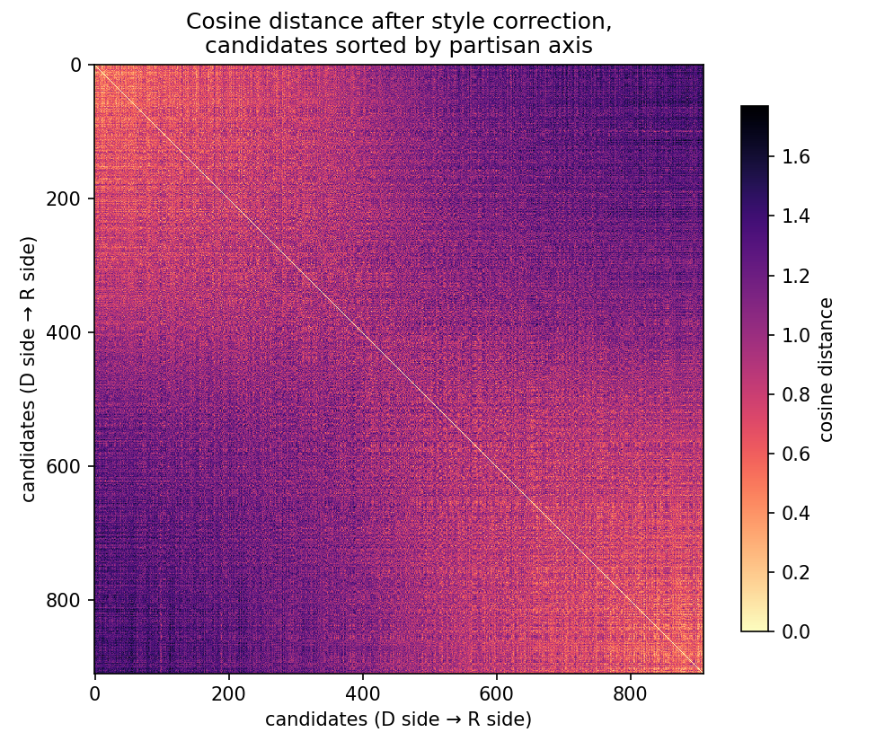
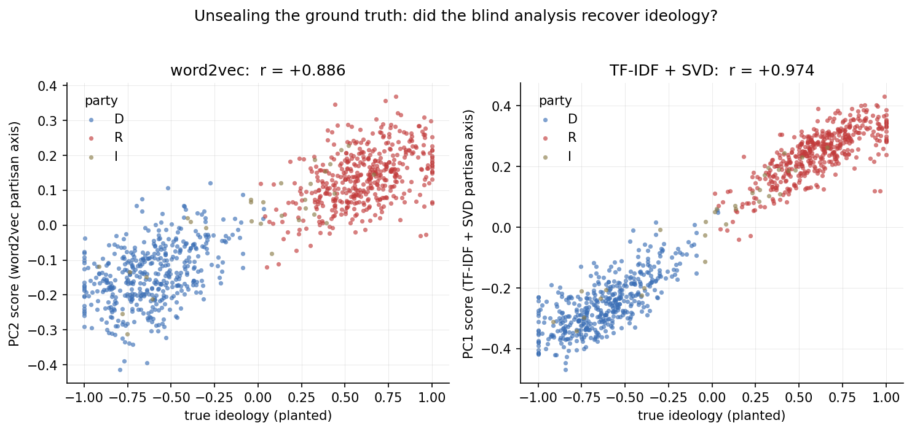

# The Simplest Thing That Could Possibly Work: Mapping 910 Candidates With Word Embeddings and PCA

*What happens when you point thirty-year-old NLP at a hundred thousand campaign tweets — and how a planted ground truth caught our fanciest method absorbing a confound.*

---

A few years ago I built a pipeline that collected the tweets of every congressional candidate in a cycle and asked a simple question: **can you tell where a candidate stands just from how they talk?** The analysis worked; the data collection killed it. Scraping every account took hours per run, rosters were tedious to assemble, and API pricing eventually made the whole thing untenable.

This post is the first step of the revival. Before pointing new methods at real data, I wanted a testbed with *known answers* — so I generated one: a synthetic corpus mimicking the 2022 midterm cycle, with 910 fictional candidates and 104,601 tweets. Crucially, the generator plants a **true ideology score** in [-1, 1] for every candidate, which drives their word choices, their topic mix, and whom they retweet. That gives us something real Twitter data never offers: after running an analysis blind, we can unseal the answer key and score ourselves.

The plan for this first pass is deliberately old-school:

1. Embed every candidate's language with **word2vec** — trained on the corpus itself, tweets averaged into one vector per candidate — with a **TF-IDF + SVD** sparse baseline for comparison.
2. Reduce with **PCA** and look at the map.
3. Measure **cosine distances** between candidates: who sounds most alike, who sounds most unalike.
4. Only then, unseal the ground truth and see what we actually recovered.

No transformers, no LLMs, no fine-tuning. The point is to establish what the simplest thing can do, so that everything fancier has a baseline to beat.

*(One honesty note up front: because the corpus is synthetic and template-generated, its vocabulary is tiny — about 800 distinct words. That makes every method's life easier than real Twitter would. The value here is testing the** pipeline logic**, not estimating real-world accuracy.)*

---

## The data, and the blind protocol

Each row of the corpus is one tweet: candidate, party, chamber, state, incumbency, timestamp, text, and whether it's a retweet. Retweets are 26.5% of the corpus, and — matching the stance of the original research — **we count them as candidate speech**. A retweet is language the candidate chose to amplify; that choice is signal.

The generator also wrote three answer-key columns into the file: `true_topic`, `true_framing`, and `true_ideology`. Step one of the pipeline seals these away — they're written to a separate file and dropped from the working data. Everything below runs blind: the only labels we allow ourselves are the ones a real dataset would have (party, chamber, state, incumbency, posting behavior).

After cleaning — lowercase, strip URLs and @mentions, unpack hashtags into words — we have **1.44 million tokens** across 910 candidates, median 99 tweets each.

## Step 1: One vector per candidate

The embedding recipe is as straightforward as it gets:

- Train **word2vec** (skip-gram, 100 dimensions, window 5, 10 epochs) on all 104,601 tweets.
- Represent each candidate as the **average of the word vectors of every token they tweeted**.

That's it. No sentence models, no weighting schemes. Averaging is crude — it blends a candidate's healthcare tweets with their July 4th greetings into one point — but crude is the point of a baseline.

A quick sanity check says the space learned something real. Nearest neighbors of `border`: *wall, patrol, agents, deterrence*. Nearest neighbors of `taxes`: *less, freedom, lower, government*. The model has picked up how campaign language clusters.

Alongside it we build the classic sparse alternative: concatenate each candidate's tweets into one document, vectorize with **TF-IDF**, reduce to the same 100 dimensions with truncated SVD. If a method from 1972 (weighted word counts) keeps up with the neural one, that's worth knowing.

## Step 2: The map

PCA both spaces down and plot the first two components, colored by party — the observable label:

Both maps separate blue from red, and this is the picture that motivates the whole research program: **nobody told either model what a Democrat or Republican is.** The separation emerges purely from word choice.

But look closer, because the two maps disagree about something important. In the TF-IDF map, the party split *is* the first principal component — the single biggest direction of variation in how candidates talk. In the word2vec map, the parties separate **vertically**: along PC2, not PC1. Word2vec's biggest axis of variation — 23% of all variance — is something else entirely.

This is the first methodological lesson, and it's one I'd underline for anyone doing embedding work: **never assume PC1 is the axis you care about.** Instead of eyeballing, the pipeline identifies the *partisan axis* empirically — the component most correlated with the observable D/R label. For TF-IDF that's PC1 (|r| = .94); for word2vec it's PC2 (|r| = .86).

So what *is* word2vec's PC1? We're still blind to ideology, but posting behavior is observable, so we can check the obvious suspects. Tweet volume: r = .01. **Retweet share: r = .96.**

The dominant axis of the neural embedding space is not politics. It's *how much of your feed is retweets*. Retweeted text has a slightly different register than original text — different sentence templates, different framing — and because our candidate vectors are raw averages, candidates who retweet a lot drift together regardless of party. The averaging step quietly turned a style variable into the main dimension of the space.

Checking the other observables rules out subtler artifacts — the map isn't secretly organized by chamber or incumbency:

And the partisan axis itself looks exactly like political language should: two humps with a contested middle, independents scattered across the overlap.

## Step 3: Who sounds alike — and the confound that almost got away

With one vector per candidate, "who sounds alike" is just cosine distance. First, the raw space. The ten most-alike pairs are all same-party, which is reassuring — for example:

| Most alike (raw) | distance |
|---|---|
| Wendell Bickford (D-NY) ↔ Jocelyn Ostrander (D-NJ) | 0.0025 |
| York Delacroix (D-CA) ↔ Ximena Jankowski (D-MO) | 0.0030 |
| Flora Xiong (R-CA) ↔ Ivan Lindqvist (R-MD) | 0.0034 |

But the most-*unalike* list has a problem. Four of the top ten most-distant pairs are **same-party pairs** — Hattie Underhill (R-CA) shows up as maximally distant from fellow Republicans Lavinia Xiong and Uriel Fairbanks. Given what we learned about PC1, we know why: those pairs sit at opposite ends of the *retweet-style* axis. The raw distance measure is answering "who differs most in language?" with "people with different retweeting habits," which is not the question.

Since retweet share is observable, the fix is legitimate even under the blind protocol: **project the style component out of the vectors and recompute.** After correction, the picture snaps into focus:

| Most unalike (corrected) | distance |
|---|---|
| Maeve Dunmore (R-GA) ↔ Sterling Calloway (D-MO) | 1.770 |
| Renata Wexford (R-WA) ↔ Walker Delacroix (D-MN) | 1.769 |
| Russell Calloway (D-FL) ↔ Lavinia Underhill (R-TX) | 1.765 |

Every one of the ten most-unalike pairs is now cross-party, and the most-alike pairs remain same-party. The aggregate view tells the same story — after correction, same-party and cross-party pairs pull visibly apart:

Sorting the full 910×910 corrected distance matrix by the partisan axis shows the structure a polarized field should have — near neighbors along the diagonal, the far corners darkest:

## Step 4: Unsealing the answer key

Everything above was done blind. Now we open the sealed file and score the analysis against the planted `true_ideology`.

| Blind measurement | correlation with true ideology |
|---|---|
| **TF-IDF + SVD partisan axis (PC1)** | **r = +0.974** (Spearman ρ = .939) |
| word2vec partisan axis (PC2) | r = +0.886 (ρ = .856) |
| word2vec dominant axis (PC1) | r = +0.171 |
| raw pairwise distance vs true ideology gap | r = +0.281 |
| **corrected pairwise distance vs gap** | **r = +0.597** |

Three results worth sitting with.

**The blind analysis recovered the planted ideology.** A one-dimensional score extracted from word choice alone — no labels, no supervision — correlates with the hidden ground truth at .89–.97. Within each party's cluster, the *ordering* is largely right too: this isn't just party classification, it's position recovery. That is the proof-of-concept the whole project rests on.

**The humble baseline won.** TF-IDF + SVD at r = .974 essentially hit the ceiling — the generator itself links word choice to ideology at about .973, so the sparse model recovered nearly all the signal that exists. The neural method came in lower *and* arrived carrying a confound. On a corpus this clean, weighted word counts were not just competitive with word2vec; they were better.

**The confound correction was worth 2× on distances.** The correlation between embedding distance and true ideological distance more than doubled (.28 → .60) after projecting out one style dimension. If we had skipped the diagnosis, every downstream distance claim — who's alike, who's polarized — would have been quietly contaminated by retweet habits.

## What this buys the next phase

The methods here were deliberately simple, and the corpus deliberately easy. The payoff isn't the correlations — it's the **protocol**, which transfers directly to real data where no answer key exists:

1. **Seal your labels, analyze blind, validate last.** With real candidates the "answer key" role is played by external measures like DW-NOMINATE; the discipline is the same.
2. **Find your axis; don't assume it.** Identify the substantive component against observables. The interesting direction was PC2 once already.
3. **Diagnose dominant components against behavior.** Averaged embeddings will absorb style (retweet share here; tweet length, posting time, or platform quirks elsewhere). Check, then project out.
4. **Keep a dumb baseline in the race.** It tells you whether a fancy method is adding signal or just parameters.

Next up, this same testbed — same blind protocol, same scorecard — meets the modern toolkit: static embedding models like Model2Vec, topic-conditioned distances via BERTopic, and LLM-based position estimates. Now that the answer key exists, every one of those methods has to beat r = .974 set by a technique older than the candidates it's measuring.

That's a satisfyingly high bar.

---

*Code, figures, and the full five-script pipeline for this analysis are in the project repository. The synthetic corpus generator (deterministic, seeded) is available alongside it — rerun it to regenerate or resize the testbed.*
